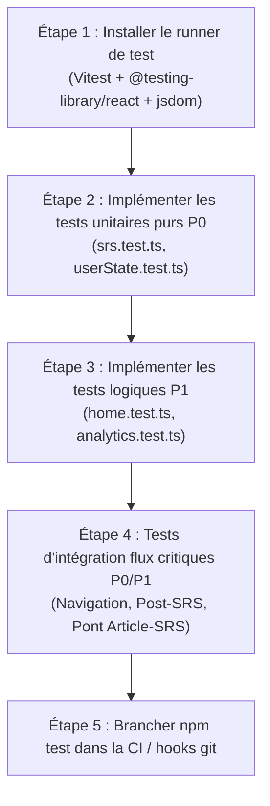

# Audit READ-ONLY de la Couverture de Tests Furago

> **Date** : 7 Octobre 2026  
> **Statut de l'audit** : STRICTEMENT READ-ONLY  
> **Auteur** : Antigravity (Auditeur QA & Architecture)  
> **Version cible** : Furago Web (Next.js 16.3.6 / React 19.2.8)  

---

## 1. Executive Summary

Le projet Furago a récemment fait l'objet de stabilisations fonctionnelles, ergonomiques et techniques majeures sur l'ensemble de ses parcours critiques (UserState, Algorithme SRS, Pont Article → SRS, Home, Navigation History API, Post-SRS & Next Best Action, Accessibilité des modales `<dialog>`, Safe Area, Analytics MVP, TTS).

Cependant, cet audit révèle un **paradoxe critique** :
* **Infrastructure de test** : **Aucun framework de test n'est installé** (ni Vitest, ni Jest, ni Playwright, ni Cypress). Le fichier `package.json` ne contient aucun script `"test"`.
* **Tests automatisés persistants** : **0 fichier de test** (`*.test.*`, `*.spec.*`) n'est présent dans le dépôt Git.
* **Les « 22 scénarios validés » du SRS** : Ils proviennent d'un script scratch Node.js temporaire (`test_srs.ts`), exécuté ponctuellement lors du développement puis supprimé. Il en va de même pour les validations de UserState (`test_userState.ts`, 10 scénarios) et du pont Article-SRS (`test_integration_srs.ts`, 8 scénarios).
* **Couverture exécutable en CI / `npm test`** : **0%**. Aucune barrière de non-régression automatisée ne protège actuellement le code.
* **Composant monolithique** : Le fichier [FuragoApp.tsx](file:///c:/Users/81704/Desktop/Code/FuragoWeb/src/components/FuragoApp.tsx) compte désormais **4 896 lignes** et concentre la quasi-totalité de l'état applicatif, du routage, des effets de bord et des flux de données. Tout refactor ou modification de la Home sans filet de sécurité présente un risque de régression élevé sur les parcours P0 (perte d'XP, blocage de navigation, écrasement SRS).

---

## 2. Test Infrastructure

### Inspection de l'environnement

| Élément | Valeur constatée | Diagnostic |
| :--- | :--- | :--- |
| **`package.json` — scripts** | `"dev"`, `"build"`, `"start"`, `"lint"` | **Aucun script `"test"`** |
| **Frameworks unitaires** | Aucun (Vitest, Jest, Mocha, Ava absents) | Non installé |
| **Frameworks E2E / Browser** | Aucun (Playwright, Cypress, Puppeteer absents) | Non installé |
| **Bibliothèques de test UI** | Aucune (`@testing-library/react`, `jsdom` absents) | Non installé |
| **Fichiers de test** | Aucun fichier `*.test.ts`, `*.test.tsx`, `*.spec.ts`, `*.spec.tsx` | Aucun test commité |
| **Scripts résiduels / scratch** | `test.txt` (0 octet), `test_dialog.html` (scratch dialog 20 lignes) | Non exploitables |
| **Outillage d'analyse statique** | ESLint 9 (`eslint-config-next`), TypeScript 5 (`tsc --noEmit`) | Opérationnels (statique uniquement) |

### Framework réellement utilisé
> **Constat formel** : **AUCUN**.  
> Le projet ne dispose actuellement d'aucun framework de test automatisé durable. Les validations mentionnées dans les rapports antérieurs (`FURAGO_SRS_IMPLEMENTATION.md`, `FURAGO_USERSTATE_VALIDATION.md`, `FURAGO_NAVIGATION_HISTORY_VALIDATION.md`) ont été réalisées via des scripts éphémères exécutés via `npx tsx` ou par inspection manuelle assistée par agent de navigateur.

---

## 3. Tests Existants

### Recensement exhaustif

| Test / Scénario | Fichier | Domaine | Ce qui est couvert | Statut | Type |
| :--- | :--- | :--- | :--- | :--- | :--- |
| **SRS Unit Scenarios (22)** | *`test_srs.ts` (supprimé)* | SRS Logic | Intervalles, `dueAt`, correct, wrong, stats, streaks | **Non reproductible** (fichier absent) | Script scratch manuel |
| **UserState Scenarios (10)** | *`test_userState.ts` (supprimé)* | UserState | Valeurs par défaut, migration legacy, clés dupliquées, fallback JSON | **Non reproductible** (fichier absent) | Script scratch manuel |
| **Article-SRS Integration (8)** | *`test_integration_srs.ts` (supprimé)* | Article → SRS | Ajout targetVocabulary, conservation stats mot existant, normalisation | **Non reproductible** (fichier absent) | Script scratch manuel |
| **Navigation History API** | *Browser Agent session* | Navigation | PopState, pushState, `historyIdx`, restauration article | **Manuel / Historique** (rapport markdown uniquement) | Validation manuelle headless |
| **Post-SRS Retention** | *Code inspection / Dev manual* | Post-SRS | Persistence P0 via `vocabReviewSource`, Next Action | **Manuel** (rapport markdown uniquement) | Inspection de code |
| **Accessibility Modals** | `test_dialog.html` + inspection | Accessibilité | `<dialog>`, focus trap, `showModal()`, escape | **Partiel / Scratch** (scratch HTML isolé) | Prototype isolé |
| **Analytics Validation** | *Inspection manuelle* | Analytics | Session 30m, payload GAS, suppression doublons | **Manuel** (rapport markdown uniquement) | Inspection de code |
| **TypeScript Compiler** | `npx tsc --noEmit` | Typage | Vérification des types statiques | **PASS (0 erreur)** | CI Statique |
| **Next.js Lint** | `npm run lint` | Linter | Règles React / Next.js | **PASS avec avertissements** (Hook deps) | CI Statique |

> [!WARNING]  
> Aucun de ces tests n'est exécutable de façon automatisée par un développeur ou un pipeline CI. Le capital de validation accumulé repose uniquement sur des comptes-rendus Markdown et des traces passées.

---

## 4. UserState

Le module [src/lib/userState.ts](file:///c:/Users/81704/Desktop/Code/FuragoWeb/src/lib/userState.ts) gère la persistance locale (`localStorage`) et sert d'unique source de vérité pour le profil utilisateur.

### Analyse détaillée de couverture

| Fonctionnalité | Logique présente dans le code | Couvert par test automatisé ? | Risque associé |
| :--- | :--- | :--- | :--- |
| **Création état par défaut** | `DEFAULT_STATE` (LVL_1, xp: 0, streak: 0...) | ❌ **NON** | Régression sur onboarding nouvel utilisateur |
| **Persistance `localStorage`** | `saveUserState` / `loadUserState` | ❌ **NON** | Corruptions de schéma, crash sur stockage indisponible |
| **Mutation atomique** | `mutateUserState` dans `FuragoApp.tsx` via `userStateRef` | ❌ **NON** | Concurrence de mutations (ex: gain XP simultané Article + Mission) |
| **Attribution de l'XP** | `awardedXP` transactionnel, mise à jour `xp` | ❌ **NON** | Double comptage ou perte d'XP sur re-render |
| **Calcul du Niveau** | `furagoLevel = Math.floor(xp / 100) + 1` | ❌ **NON** | Désynchronisation entre barre de progression et niveau affiché |
| **Streak quotidien** | `currentStreak`, `longestStreak`, `lastStreakDate` | ❌ **NON** | Remise à zéro erronée ou incrément frauduleux multi-session |
| **Migration Legacy** | Migration depuis `furago_xp`, `furago_level` (A1-C1 → LVL_1-4) | ❌ **NON** (ex-validé scratch) | Perte irrémédiable de données des utilisateurs historiques |
| **Absence de perte de données** | Spread operator `...parsed` pour clés inconnues | ❌ **NON** | Écrasement silencieux lors d'ajouts de futurs champs |

---

## 5. SRS (Spaced Repetition System)

Le module [src/lib/srs.ts](file:///c:/Users/81704/Desktop/Code/FuragoWeb/src/lib/srs.ts) implémente l'algorithme pur de répétition espacée.

### Analyse détaillée de couverture

| Règle métier | Implémentation réelle | Couvert par test automatisé ? | Risque |
| :--- | :--- | :--- | :--- |
| **Intervalles** | `[0, 1, 3, 7, 14, 30, 60]`, max 60 jours | ❌ **NON** | Saut d'intervalle ou régression algorithmique |
| **Réponse Correcte** | `correctCount++`, `reviewStreak++`, intervalle suivant, `difficulty="easy"` | ❌ **NON** | Palier d'intervalle non incrémenté |
| **Réponse Incorrecte** | `wrongCount++`, `reviewStreak=0`, intervalle remis à 1 j, `difficulty="hard"` | ❌ **NON** | Échec non pénalisé, mot repoussé trop loin |
| **Calcul de `dueAt`** | `now + interval * 86400000` | ❌ **NON** | Décalage temporel ou mot non reprogrammé |
| **Compteur `reviewStreak`** | Incrément sur succès, reset à 0 sur faute | ❌ **NON** | Mauvaise métrique de maîtrise |
| **Mots dus (`getWordsDueForReview`)** | Filtre `dueAt <= now`, tri `dueAt` ascendant | ❌ **NON** | Sélection aléatoire ou mots futurs inclus par erreur |
| **Plafond de session (5 mots)** | `dueWords.slice(0, 5)` dans [FuragoApp.tsx:624](file:///c:/Users/81704/Desktop/Code/FuragoWeb/src/components/FuragoApp.tsx#L624) | ❌ **NON** | Session infinie ou surcharge cognitive de l'apprenant |
| **Déduplication et normalisation** | `learnedWordKey` (`NFC`, `trim`, `toLowerCase("fr")`) | ❌ **NON** | Doublons avec accents ou variations de casse ("Été" / "été") |

> [!NOTE]  
> La logique de [srs.ts](file:///c:/Users/81704/Desktop/Code/FuragoWeb/src/lib/srs.ts) est une pure fonction sans dépendance au DOM. Elle est 100% testable unitairement en quelques millisecondes, mais nécessite une formalisation dans un fichier `.test.ts`.

---

## 6. Article → SRS

Ce flux interconnecte la fin de lecture d'un article avec l'alimentation du dictionnaire d'apprentissage SRS.

### Analyse détaillée des scénarios critiques

| Scénario | Mécanisme dans le code | Couverture automatisée | Risque |
| :--- | :--- | :--- | :--- |
| **Nouvel article → nouveau vocabulaire → ajout SRS** | `checkAndAwardArticleXP` appelle `mergeLearnedVocabulary` qui invoque `createSRSWord` | ❌ **NON** | Mots cibles ignorés, progression SRS non amorcée |
| **Article → mot déjà présent → pas de doublon** | `mergeLearnedVocabulary` concatène l'articleId dans `articleIds` sans toucher aux dates SRS existantes | ❌ **NON** | Écrasement des intervalles déjà acquis pour un mot révisé |
| **Article → Reward → SRS → résultat persisté** | Écran Reward → CTA SRS → `startVocabReview("learned", "reading")` → `handleRecordReviewResult` | ❌ **NON** | Résultats perdus lors du retour (P0 résolu en code, non blindé par test) |
| **Idempotence de complétion d'article** | Verrou `!completedArticleIds.includes(articleId)` | ❌ **NON** | Ré-attribution d'XP en boucle lors des relectures |

---

## 7. Home

Le fichier [src/lib/home.ts](file:///c:/Users/81704/Desktop/Code/FuragoWeb/src/lib/home.ts) et les hooks de [FuragoApp.tsx](file:///c:/Users/81704/Desktop/Code/FuragoWeb/src/components/FuragoApp.tsx) orchestrent l'écran d'accueil.

### Analyse détaillée de couverture

| Fonctionnalité | Logique métier | Couverture automatisée | Risque |
| :--- | :--- | :--- | :--- |
| **Daily Mission persistée** | `userState.dailyMissionTarget: { date, articleId, level }` | ❌ **NON** | Mission changeante à chaque chargement de page |
| **Même mission après refresh** | Comparaison `target.date === todayStr && target.level === globalLevel` | ❌ **NON** | Remplacement inopiné de l'article du jour |
| **Changement de jour (00:00)** | Invalidation conditionnelle et sélection pseudo-aléatoire déterministe basée sur la date | ❌ **NON** | Blocage sur une ancienne date |
| **Continue reading (`selectContinueArticle`)** | Ratio > 0.05, niveau valide, non complété, préférence pour le dernier ouvert | ❌ **NON** | Reprise d'articles terminés ou faux positifs à 1% de scroll |
| **Décompte SRS due (`dueCount`)** | `getWordsDueForReview(learnedWords, nowMs).length`, réactivité via listener `focus`/`visibilitychange` | ❌ **NON** | Badge erroné ou bouton actif alors qu'aucun mot n'est dû |
| **Recommandations (`selectRecommendedArticles`)** | Non complétés, triés par date décroissante, diversité des catégories | ❌ **NON** | Articles dupliqués, articles déjà lus suggérés |
| **Retour Review → Home** | `vocabReviewReturnTo === "home"` | ❌ **NON** | Redirection vers une vue inattendue |
| **Home scroll restoration** | `sessionStorage.getItem("furago_home_scroll_" + idx)` et `window.scrollTo` | ❌ **NON** | Perte de position de lecture lors du retour arrière |

---

## 8. Navigation

La navigation repose sur la History API native (`pushState`, `replaceState`, `popstate`) synchronisée avec l'état React.

### Analyse détaillée de couverture

```text
Transitions critiques :
Home → Article → Back  => Doit restaurer Home sans réactualiser
Home → Words → Back    => Doit restaurer Home
Home → Review → Back   => Doit restaurer Home
Words → Review → Back  => Doit restaurer Words
Back → Forward         => Doit ré-ouvrir l'article ou la vue suivante
```

| Aspect | Implémentation réelle | Couverture automatisée | Risque |
| :--- | :--- | :--- | :--- |
| **Gestion `historyIdx`** | Incrémenté sur `pushState`, conservé sur `replaceState` | ❌ **NON** | Perte de contexte, boucle infinie de navigation |
| **Bouton Retour physique / UI** | `window.history.back()` si `historyIdx > 0`, sinon fallback `replaceState` vers Home | ❌ **NON** | Éjection involontaire de l'application vers un site externe |
| **PopState listener** | `handlePopState` synchronise `activeView` sans rappeler `pushState` | ❌ **NON** | Empilement récursif d'historique |
| **Synchronisation URL directe** | `/?view=reading&id=...` avec restauration automatique de l'article | ❌ **NON** | Écran blanc ou article 404 non intercepté |

---

## 9. Post-SRS

Le parcours Post-SRS a été identifié comme un pivot d'engagement et de rétention.

### Analyse détaillée de couverture

| Parcours Post-SRS | Comportement attendu | Couvert ? | Risque résiduel |
| :--- | :--- | :--- | :--- |
| **P0 Persistence — Home → SRS** | `recordReviewResult` persistant dans `learnedVocabulary` | ❌ **NON** | Mots restent dus après une révision complète |
| **P0 Persistence — Reward → SRS** | `recordReviewResult` persistant dans `learnedVocabulary` | ❌ **NON** | Mots restent dus après une révision post-lecture |
| **P0 Persistence — Words → SRS** | `recordReviewResult` persistant dans `learnedVocabulary` | ❌ **NON** | Mots restent dus depuis le carnet |
| **Remaining Queue** | 10 dus → lot de 5 terminé → 5 restants affichés précisément | ❌ **NON** | Calcul erroné de la file résiduelle |
| **Continue Review CTA** | Bouton `🔄 Continuer les révisions (+5)` qui enchaîne sur le lot suivant | ❌ **NON** | Bouton inopérant ou boucle infinie |
| **Next Best Action (Reward → SRS finish)** | Prochain épisode (série) ou prochain article (catalogue) si file vide | ❌ **NON** | Cul-de-sac ergonomique ou retour vers l'article déjà lu |
| **Next Best Action (Home → SRS finish)** | Reprise de lecture en cours ou mission du jour si file vide | ❌ **NON** | Absence de CTA d'engagement |

---

## 10. Analytics

Le module [src/lib/analytics.ts](file:///c:/Users/81704/Desktop/Code/FuragoWeb/src/lib/analytics.ts) assure le suivi de la rétention vers Google Apps Script.

### Analyse détaillée de couverture

| Exigence Analytics | Implémentation | Couvert ? | Risque |
| :--- | :--- | :--- | :--- |
| **Génération user_id** | `furago_analytics_user_id` (UUID v4) | ❌ **NON** | ID régénéré à chaque session, biaisant les cohortes |
| **Génération session_id** | `furago_analytics_session_id` | ❌ **NON** | Perte de la continuité de session |
| **Expiration 30 min** | `SESSION_TIMEOUT_MS = 30 * 60 * 1000` | ❌ **NON** | Session jamais expirée ou expirée prématurément |
| **Événement `session_start`** | Déclenché à l'ouverture ou au réveil (> 30 min) | ❌ **NON** | Dénominateur de rétention faussé |
| **Événement `home_cta_clicked`** | Émis avec `cta_type` et `position` sur les 4 cartes | ❌ **NON** | Absence de tracking du module déclencheur |
| **Événement `article_started`** | Émis avec `article_id` et `source` | ❌ **NON** | Attribution de conversion perdue |
| **Absence de doublons** | Verrou `analyticsFiredRef` dans les `useEffect` | ❌ **NON** | Double comptage lors des re-renders React 19 |
| **Non-blocage réseau** | `fetch(..., { redirect: "follow" }).catch(...)` silencieux | ❌ **NON** | Exception réseau non gérée gelant l'interface |

---

## 11. TTS (Text-to-Speech)

La synthèse vocale repose sur la Web Speech API du navigateur (`speechSynthesis`, `SpeechSynthesisUtterance`).

### Analyse de testabilité et couverture

| Scénario TTS | Testable sans vrai navigateur ? | Couvert ? | Risque |
| :--- | :--- | :--- | :--- |
| **API absente (`!window.speechSynthesis`)** | ✅ **Oui** (mock simple) | ❌ **NON** | Crash SSR ou crash sur navigateurs non compatibles |
| **Play (démarrage lecture)** | ✅ **Oui** (mock `speak`) | ❌ **NON** | File de lecture non construite ou index figé |
| **Pause (mise en pause)** | ✅ **Oui** (mock `cancel`) | ❌ **NON** | État `isPaused` désynchronisé de l'UI |
| **Restart (reprise au début)** | ✅ **Oui** (mock timer / reset index) | ❌ **NON** | Décalage du curseur de mot |
| **Canceled (erreur normale)** | ✅ **Oui** (`onerror` avec `error: "canceled"`) | ❌ **NON** | Erreur "canceled" traitée comme un crash, arrêt de l'UI |
| **Erreur réelle** | ✅ **Oui** (simulation `onerror`) | ❌ **NON** | Blocage infini du lecteur en état `isPlaying: true` |
| **Highlighting mot à mot** | ⚠️ **Partiel** (dépend de `onboundary`) | ❌ **NON** | Surlignage décalé ou de la phrase complète au lieu du mot |
| **Voix iOS Safari** | ❌ **Non** (nécessite vrai device) | ❌ **NON** | Incompatibilité de sélection de voix sur WebKit iOS |

---

## 12. Mobile / Accessibility

### Analyse de couverture & frontière d'automatisation

| Domaine | Élément vérifié | Type de test requis | Couvert actuellement ? |
| :--- | :--- | :--- | :--- |
| **Boutons interactifs** | Tous les mots cliquables et actions sont des `<button>` | Unitaire / DOM (@testing-library) | ❌ **NON** (inspection uniquement) |
| **Labels & Formulaires** | `aria-label`, `<label for="...">`, `aria-labelledby` | Unitaire / Axe-core / Lint a11y | ❌ **NON** (inspection uniquement) |
| **Clavier & Focus trap** | Modales `<dialog>` natives, touche Escape, piège de focus | Unitaire / DOM (@testing-library) | ❌ **NON** (inspection uniquement) |
| **Restauration de focus** | Focus rendu à l'élément déclencheur à la fermeture de modale | Unitaire / DOM (@testing-library) | ❌ **NON** (inspection uniquement) |
| **Touch targets (>= 44px)** | Hauteur et largeur effectives des zones cliquables | **Nécessite navigateur réel** (Playwright/Puppeteer) | ❌ **NON** (CSS statique uniquement) |
| **Safe Area Inset** | `env(safe-area-inset-bottom)` dans bottom bar et modales | **Nécessite navigateur réel / Device mobile** | ❌ **NON** (CSS statique uniquement) |
| **Clavier virtuel mobile** | Visual viewport resize, masquage des champs de saisie | **Nécessite device mobile réel / simulateur** | ❌ **NON** (manuel uniquement) |

---

## 13. Critical Path Matrix

Cette matrice hiérarchise les risques actuels d'absence de tests sur les parcours fondamentaux.

| Domaine | Couverture actuelle | Niveau de Risque | Test recommandé | Priorité |
| :--- | :---: | :---: | :--- | :---: |
| **SRS Logic** | 0% (ex-scratch) | **CRITIQUE** | Test unitaire pur : algorithme, intervalles, réinitialisation, `dueAt` | **P0** |
| **UserState & Mutations** | 0% (ex-scratch) | **CRITIQUE** | Test unitaire pur : création, mutations, XP, streak, migration legacy | **P0** |
| **Post-SRS Persistence** | 0% | **CRITIQUE** | Test intégration : persistance des réponses SRS (Home, Reward, Words) | **P0** |
| **Article → SRS Pipeline** | 0% (ex-scratch) | **CRITIQUE** | Test intégration : complétion article → déduplication → ajout vocabulaire | **P0** |
| **Navigation & History API** | 0% (ex-manuel) | **ÉLEVÉ** | Test composant : `pushState`, `popstate`, bouton Retour, `historyIdx` | **P0** |
| **Post-SRS Next Best Action** | 0% | **ÉLEVÉ** | Test flux : aiguillage dynamique post-session (série, catalogue, home) | **P1** |
| **Home Deterministic Pickers** | 0% | **ÉLEVÉ** | Test unitaire : `selectContinueArticle`, `selectRecommendedArticles`, Daily Mission | **P1** |
| **Analytics Session & Events** | 0% | **MOYEN** | Test unitaire : expiration 30m, génération UUID, intégrité payload | **P1** |
| **Accessibility Modals & Trap** | 0% (ex-manuel) | **MOYEN** | Test composant : `<dialog>`, touche Escape, focus return | **P1** |
| **TTS State Machine** | 0% | **MOYEN** | Test unitaire : machine d'états Play/Pause/Restart/Canceled avec mocks | **P2** |
| **Safe Area & Touch Targets** | 0% | **FAIBLE** | Test E2E Playwright Mobile : bounding rects >= 44px, safe area padding | **P2** |

---

## 14. Minimum Test Suite Recommended

Pour sécuriser l'application avant toute refonte de la Home, tout découpage de `FuragoApp.tsx` ou toute mise en production, une suite minimale de **15 scénarios hautement ciblés** doit être mise en place.

### Fichiers et scénarios recommandés (15 scénarios)

#### 1. `src/lib/srs.test.ts` (4 scénarios P0)
1. **SRS-01** : `createSRSWord` initialise le mot avec un intervalle de 0 jour et `dueAt = now`.
2. **SRS-02** : `recordReviewResult` avec réponse correcte passe séquentiellement par les intervalles (0 → 1 → 3 → 7 → 14 → 30 → 60), incrémente `correctCount` et `reviewStreak`.
3. **SRS-03** : `recordReviewResult` avec réponse incorrecte ramène l'intervalle à 1 jour, incrémente `wrongCount` et remet `reviewStreak` à 0.
4. **SRS-04** : `getWordsDueForReview` retourne uniquement les mots dont `dueAt <= now`, triés par date d'échéance croissante (overdue first).

#### 2. `src/lib/userState.test.ts` (3 scénarios P0)
5. **STATE-01** : `loadUserState` initialise un état valide avec les valeurs par défaut en l'absence de données `localStorage`.
6. **STATE-02** : `loadUserState` migre correctement les clés historiques (`furago_xp`, `furago_level` de "A1" à "LVL_1", `furago_words`).
7. **STATE-03** : `mergeLearnedVocabulary` ajoute un nouveau mot avec ses métadonnées SRS, normalise la casse/accents, et si le mot existe déjà, ajoute uniquement l'articleId sans écraser la progression SRS.

#### 3. `src/lib/home.test.ts` (2 scénarios P1)
8. **HOME-01** : `selectContinueArticle` sélectionne l'article non complété ayant un ratio > 0.05 au bon niveau, en priorisant le dernier article ouvert.
9. **HOME-02** : `selectRecommendedArticles` retourne les articles non complétés avec diversité de catégorie et sans doublon.

#### 4. `src/lib/analytics.test.ts` (2 scénarios P1)
10. **ANALYTICS-01** : `getOrCreateSessionId` conserve le même `session_id` pour des actions à moins de 30 minutes d'intervalle, et génère un nouvel ID avec `isNew: true` après 30 minutes d'inactivité.
11. **ANALYTICS-02** : `trackEvent` construit le payload correct (user_id, session_id, eventName, params) et n'échoue jamais même si le réseau est indisponible.

#### 5. `src/components/navigation_and_post_srs.test.tsx` (4 scénarios P0/P1)
12. **NAV-01** : `navigateTo` incrémente `historyIdx` et pousse l'URL dans `window.history`. Un appel à `handleBack` invoque `history.back()` si `historyIdx > 0` ou redirige vers "home" sans éjecter du site si `historyIdx === 0`.
13. **POST-SRS-01** : Répondre à un mot SRS lancé depuis l'écran Home ou Reward met à jour et persiste immédiatement `learnedVocabulary` dans le `UserState`.
14. **POST-SRS-02** : Quand une session SRS se termine avec des mots restants (`dueRemaining > 0`), le décompte exact et le bouton « Continuer les révisions (+5) » sont affichés.
15. **POST-SRS-03** : Quand toutes les révisions sont achevées (`dueRemaining === 0`) depuis l'écran Reward, la CTA principale propose directement l'épisode ou l'article suivant.

---

## 15. Priorités

### Feuille de route d'implémentation recommandée



1. **Choix du framework recommandé** : **Vitest**
   * *Raison* : Compatible nativement avec TypeScript et ECMAScript Modules (ESM), ultra-rapide, zéro configuration lourde par rapport à Jest sous Next.js 16/Turbopack, et utilise l'API standard `describe / it / expect`.
2. **Ordre de déploiement** :
   * **Immédiat (avant tout refactor de code)** : Étapes 1 & 2 (100% de la logique SRS et UserState couverte en pur unitaire, aucun mock complexe).
   * **Court terme (avant release)** : Étapes 3 & 4 (flux de navigation et rétention Post-SRS).
   * **Moyen terme (post-MVP)** : Tests E2E Playwright pour les touch targets et le rendu mobile réel.

---

## 16. Conclusion

L'audit confirme que les récents chantiers de stabilisation ont doté Furago de fonctionnalités robustes et d'une logique métier saine. Néanmoins, **cette robustesse est actuellement sans filet de sécurité automatisé** :
* 0 framework installé ;
* 0 test exécutable ;
* Les 22 scénarios SRS n'étaient qu'une validation ponctuelle éphémère.

Avant de lancer le refactoring de [FuragoApp.tsx](file:///c:/Users/81704/Desktop/Code/FuragoWeb/src/components/FuragoApp.tsx) ou toute évolution de la Home, la priorité absolue est d'installer **Vitest** et de concrétiser la suite minimale de **15 scénarios critiques** identifiée dans ce rapport.
